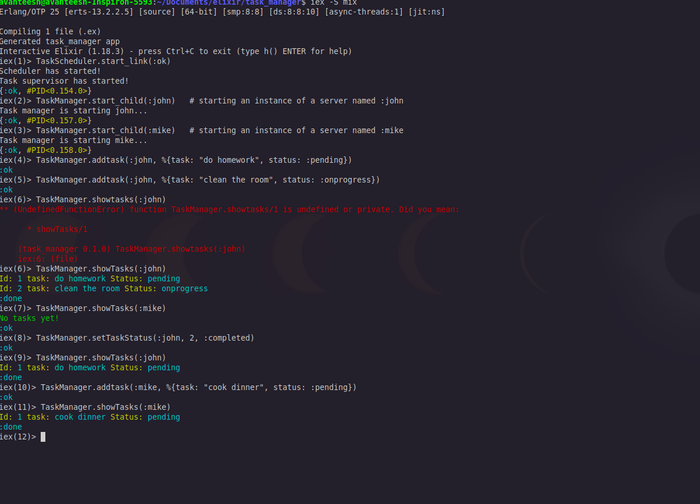

# A Mini TaskScheduler implemented with GenServer in Elixir 

<p>GenServer is a built in utility that allows concurrent IPC (Inter process communication) and message passing in Elixir. It works by creating multiple 
child processes for each Client, and ease for state-management for Data. GenServers are used for building concurrent, fault-tolerant systems by encapsulating state and providing callbacks.
It uses Supervisor module too manage a hierarchy of processes (clients).
<p>

# Test
<div>
  
</div>

<h1>Dev dependency!</h1>
## Installation

If [available in Hex](https://hex.pm/docs/publish), the package can be installed
by adding `task_manager` to your list of dependencies in `mix.exs`:

```elixir
def deps do
  [
    {:task_manager, "~> 0.1.0"}
  ]
end
```

Documentation can be generated with [ExDoc](https://github.com/elixir-lang/ex_doc)
and published on [HexDocs](https://hexdocs.pm). Once published, the docs can
be found at <https://hexdocs.pm/task_manager>.

